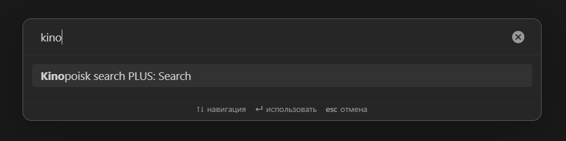
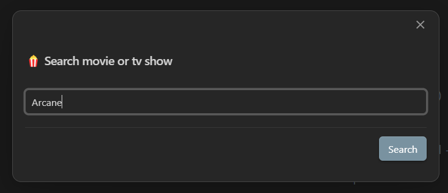
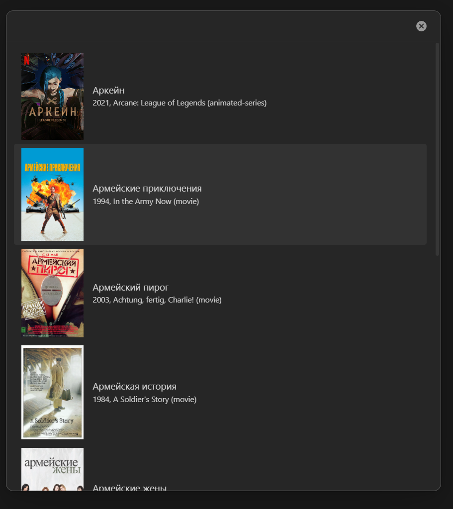
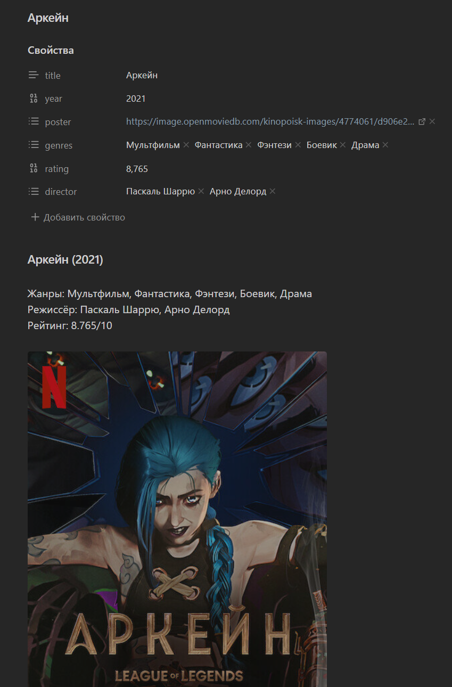
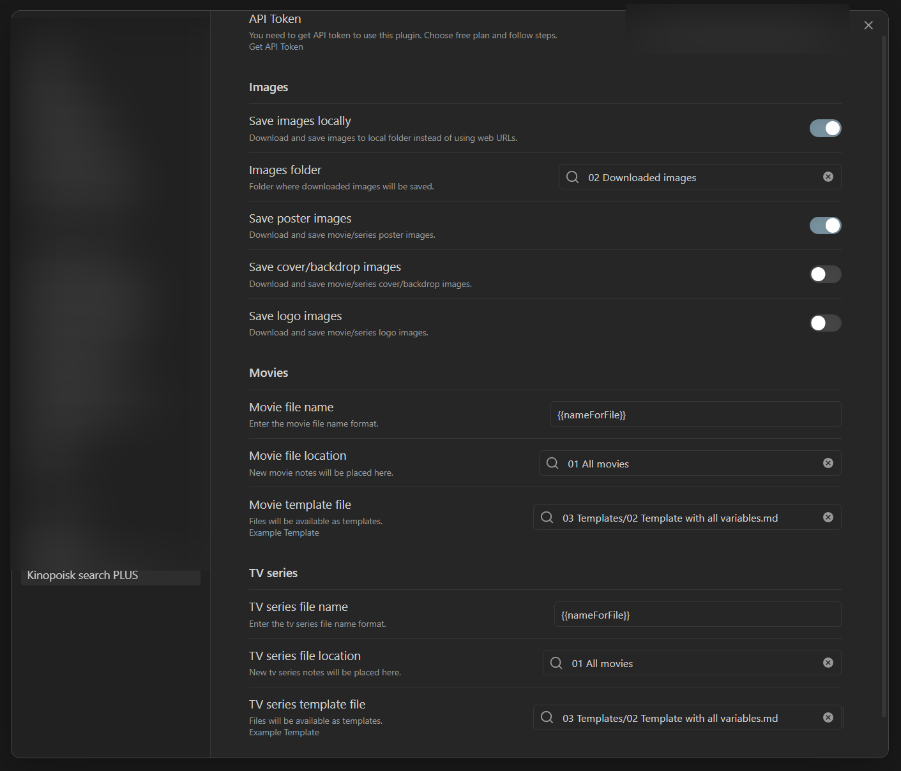

# Credits

Based on the original work by [Alintor](https://github.com/Alintor)

---

# Plugin Differences

Key differences between the [original plugin](https://github.com/Alintor/obsidian-kinopoisk-plugin) and this plugin:

1. **Extended variable support** - More template variables are now available.
2. **Image storage toggle** - Option to enable/disable saving images to your vault.
3. **Improved UI and UX** – The user interface and experience have been refined for smoother interaction.
4. **Better Obsidian compatibility** - Improved integration with Obsidian features
5. **Bug fixes** - Minor issues from the original version have been resolved

---

# Obsidian Kinopoisk Plugin Plus

Easily search movies and TV shows info via Kinopoisk and create notes.

---

# Description

Search movies and TV shows information from Kinopoisk database.

Uses the Kinopoisk.dev API to retrieve comprehensive film and series data.

---

# How to install

**Option 1:** Search for "Kinopoisk Search Plus" in the Obsidian Community plugins _(coming soon to Community Plugins)_

**Option 2:** Manual installation - download the latest release files (`main.js`, `manifest.json`, `styles.css`) from [Releases](https://github.com/2PleXXX/obsidian-kinopoisk-search-plus-plugin/releases) and place them in your vault's `.obsidian/plugins/kinopoisk-search-plus/` folder.

---

# How to use

### 1. Click the ribbon icon, or execute the command "Kinopoisk search Plus"



### 2. Search for movies or TV series by keywords



### 3. Select the item from the search results



### 4. Voila! A note has been created



---

# Configure plugin in settings



---

# Get API Token

You need an API token to use this plugin.

1. Visit [kinopoisk.dev](https://kinopoisk.dev/)
2. Choose the free plan
3. Follow the registration steps
4. Copy your API token to the plugin settings

---

# New file name

You can customize the file name format for generated notes.

> **Example:** Using the default format, "The Matrix" (1999) would create a file named `The Matrix (1999).md`

**Default format:** `{{nameForFile}} ({{year}})`

This creates files like "The Matrix (1999).md"

**Learn more about naming options:** [File Naming Options](#file-naming-options)

---

# New file location

Set the folder location where new files are created.

If no location is specified, new files are created in the Obsidian root folder.

---

# Image Storage

Enable image saving in the plugin settings and specify the path to the folder where selected images will be saved.

**Default folder:** `attachments/kinopoisk`

**Available download options:**

-   **Posters** - Movie/TV show poster images
-   **Covers** - Wide cover images
-   **Logos** - Film/series logo images

---

# Template file

You can set a custom template file location to format your movie notes.

## Example template

Please refer to the template variables definitions below for available variables (see: [Template variables definitions](#template-variables-definitions)).

```
---
title: {{name}}
year: {{year}}
poster: {{posterUrl}}
genres: [{{genres}}]
rating: {{ratingKp}}
director: [{{director}}]
---

# {{name}} ({{year}})

Жанры: {{genres}}
Режиссёр: {{director}}
Рейтинг: {{ratingKp}}/10


## Описание
{{description}}

## Интересные факты
{{facts}}
```

### ⚠️ Important Template Editing Warning

> **Critical:** Always edit templates in **Source mode** only. Using Obsidian's visual editor will automatically reformat the template syntax, breaking functionality. Template modifications must be made exclusively in source mode to preserve proper formatting.

---

# Template variables definitions

Please find here a definition of the possible variables to be used in your template. Simply write `{{name}}` in your template, and replace `name` by the desired data, including:

## 📖 Basic Information

| Variable               | Description                                  | Type   | List | Example                                            |
| ---------------------- | -------------------------------------------- | ------ | ---- | -------------------------------------------------- |
| `{{id}}`               | Unique film identifier in Kinopoisk database | Number | ❌   | `301`                                              |
| `{{name}}`             | Main Russian film/series title               | String | ✅   | `Матрица`                                          |
| `{{alternativeName}}`  | Alternative title (usually original)         | String | ✅   | `The Matrix`                                       |
| `{{year}}`             | Film/series release year                     | Number | ❌   | `1999`                                             |
| `{{description}}`      | Full film plot description                   | String | ✅   | `Жизнь Томаса Андерсона разделена на две части...` |
| `{{shortDescription}}` | Brief film description (1-2 sentences)       | String | ✅   | `Хакер Нео узнает о существовании Матрицы`         |

## 🖼️ Images

> ⚠️ **Important:** Distinguish between URL variables (direct links) and ImageLink variables (ready markdown links)

### URL variables (direct links)

Contain only image URLs without markdown formatting. Always contain web links, even if images are downloaded locally.

| Variable        | Description                       | Type | List | Example                             |
| --------------- | --------------------------------- | ---- | ---- | ----------------------------------- |
| `{{posterUrl}}` | Direct link to film poster        | URL  | ✅   | `https://image.tmdb.org/poster.jpg` |
| `{{coverUrl}}`  | Direct link to cover (wide image) | URL  | ✅   | `https://image.tmdb.org/cover.jpg`  |
| `{{logoUrl}}`   | Direct link to film logo          | URL  | ✅   | `https://image.tmdb.org/logo.png`   |

### ImageLink variables (ready markdown links)

Contain ready markdown links for displaying images in Obsidian. Use local file references when images are downloaded, web links otherwise.

| Variable              | Description                   | Type     | List | Example                                 |
| --------------------- | ----------------------------- | -------- | ---- | --------------------------------------- |
| `{{posterImageLink}}` | Ready markdown link to poster | Markdown | ✅   | `![[poster.jpg]]`                       |
| `{{coverImageLink}}`  | Ready markdown link to cover  | Markdown | ✅   | `` |
| `{{logoImageLink}}`   | Ready markdown link to logo   | Markdown | ✅   | `![[logo.png]]`                         |

### Key Differences

-   **URL variables**: Always contain original web URLs for external access
-   **ImageLink variables**:
    -   For downloaded images: Use wiki-links `![[filename.jpg]]` (portable, work after file moves)
    -   For web images: Use markdown links `` (fallback when download fails)

## 🎭 Classification

| Variable             | Description                          | Type   | List | Example                       |
| -------------------- | ------------------------------------ | ------ | ---- | ----------------------------- |
| `{{genres}}`         | Film genres                          | String | ✅   | `Фантастика, Боевик, Триллер` |
| `{{genresLinks}}`    | Genres as Obsidian links             | Link   | ✅   | `[[Фантастика]], [[Боевик]]`  |
| `{{countries}}`      | Film production countries            | String | ✅   | `США, Великобритания`         |
| `{{countriesLinks}}` | Countries as Obsidian links          | Link   | ✅   | `[[США]], [[Великобритания]]` |
| `{{type}}`           | Content type (film, series, cartoon) | String | ✅   | `Фильм`                       |
| `{{subType}}`        | Content subtype                      | String | ✅   | `Полнометражный`              |

## 👥 Project Participants

| Variable             | Description                     | Type   | List | Example                         |
| -------------------- | ------------------------------- | ------ | ---- | ------------------------------- |
| `{{director}}`       | Film directors                  | String | ✅   | `Лана Вачовски, Лилли Вачовски` |
| `{{directorsLinks}}` | Directors as Obsidian links     | Link   | ✅   | `[[Лана Вачовски]]`             |
| `{{actors}}`         | Main film actors                | String | ✅   | `Киану Ривз, Лоуренс Фишберн`   |
| `{{actorsLinks}}`    | Actors as Obsidian links        | Link   | ✅   | `[[Киану Ривз]]`                |
| `{{writers}}`        | Film screenwriters              | String | ✅   | `Лана Вачовски, Лилли Вачовски` |
| `{{writersLinks}}`   | Screenwriters as Obsidian links | Link   | ✅   | `[[Лана Вачовски]]`             |
| `{{producers}}`      | Film producers                  | String | ✅   | `Джоэл Сильвер`                 |
| `{{producersLinks}}` | Producers as Obsidian links     | Link   | ✅   | `[[Джоэл Сильвер]]`             |

## ⚙️ Technical Specifications

| Variable                  | Description                               | Type    | List | Example |
| ------------------------- | ----------------------------------------- | ------- | ---- | ------- |
| `{{movieLength}}`         | Film duration in minutes                  | Number  | ❌   | `136`   |
| `{{isSeries}}`            | Whether content is a series               | Boolean | ❌   | `false` |
| `{{seriesLength}}`        | Average episode duration in minutes       | Number  | ❌   | `45`    |
| `{{totalSeriesLength}}`   | Total duration of all episodes in minutes | Number  | ❌   | `2700`  |
| `{{isComplete}}`          | Whether series is completed               | Boolean | ❌   | `true`  |
| `{{seasonsCount}}`        | Number of series seasons                  | Number  | ❌   | `3`     |
| `{{seriesInSeasonCount}}` | Average number of episodes per season     | Number  | ❌   | `12`    |

## ⭐ Ratings and Votes

| Variable                       | Description                          | Type   | List | Example   |
| ------------------------------ | ------------------------------------ | ------ | ---- | --------- |
| `{{ratingKp}}`                 | Kinopoisk rating (0-10)              | Number | ❌   | `8.5`     |
| `{{ratingImdb}}`               | IMDb rating (0-10)                   | Number | ❌   | `8.7`     |
| `{{ratingFilmCritics}}`        | Film critics rating (0-10)           | Number | ❌   | `7.8`     |
| `{{ratingRussianFilmCritics}}` | Russian film critics rating (0-10)   | Number | ❌   | `8.1`     |
| `{{votesKp}}`                  | Number of votes on Kinopoisk         | Number | ❌   | `524891`  |
| `{{votesImdb}}`                | Number of votes on IMDb              | Number | ❌   | `1789321` |
| `{{votesFilmCritics}}`         | Number of film critics votes         | Number | ❌   | `143`     |
| `{{votesRussianFilmCritics}}`  | Number of Russian film critics votes | Number | ❌   | `25`      |

## 🔗 External Links and Identifiers

| Variable           | Description                           | Type   | List | Example                              |
| ------------------ | ------------------------------------- | ------ | ---- | ------------------------------------ |
| `{{kinopoiskUrl}}` | Direct link to film page on Kinopoisk | URL    | ✅   | `https://www.kinopoisk.ru/film/301/` |
| `{{imdbId}}`       | Film identifier in IMDb database      | String | ✅   | `tt0133093`                          |
| `{{tmdbId}}`       | Film identifier in TMDb database      | Number | ❌   | `603`                                |
| `{{kpHDId}}`       | Identifier in Kinopoisk HD system     | String | ✅   | `4e8f2f8e4b8b4c8d`                   |

## 📝 Additional Information

| Variable         | Description                          | Type   | List | Example                           |
| ---------------- | ------------------------------------ | ------ | ---- | --------------------------------- |
| `{{slogan}}`     | Film promotional slogan              | String | ✅   | `Добро пожаловать в реальный мир` |
| `{{ageRating}}`  | Age restriction (years)              | Number | ❌   | `16`                              |
| `{{ratingMpaa}}` | MPAA rating (G, PG, PG-13, R, NC-17) | String | ✅   | `R`                               |

## 💰 Financial Information

| Variable                 | Description                   | Type   | List | Example     |
| ------------------------ | ----------------------------- | ------ | ---- | ----------- |
| `{{budgetValue}}`        | Film budget amount            | Number | ❌   | `63000000`  |
| `{{budgetCurrency}}`     | Budget currency               | String | ✅   | `$`         |
| `{{feesWorldValue}}`     | Worldwide box office          | Number | ❌   | `467222824` |
| `{{feesWorldCurrency}}`  | Worldwide box office currency | String | ✅   | `$`         |
| `{{feesRussiaValue}}`    | Russia box office             | Number | ❌   | `1200000`   |
| `{{feesRussiaCurrency}}` | Russia box office currency    | String | ✅   | `$`         |
| `{{feesUsaValue}}`       | USA box office                | Number | ❌   | `171479930` |
| `{{feesUsaCurrency}}`    | USA box office currency       | String | ✅   | `$`         |

## 📅 Premiere Dates

| Variable              | Description                        | Type | List | Example      |
| --------------------- | ---------------------------------- | ---- | ---- | ------------ |
| `{{premiereWorld}}`   | World premiere date (YYYY-MM-DD)   | Date | ❌   | `1999-03-24` |
| `{{premiereRussia}}`  | Russia premiere date (YYYY-MM-DD)  | Date | ❌   | `1999-06-10` |
| `{{premiereDigital}}` | Digital premiere date (YYYY-MM-DD) | Date | ❌   | `1999-12-15` |
| `{{premiereCinema}}`  | Cinema premiere date (YYYY-MM-DD)  | Date | ❌   | `1999-03-31` |

## 📊 Release Periods and Rankings

| Variable                | Description                             | Type   | List | Example |
| ----------------------- | --------------------------------------- | ------ | ---- | ------- |
| `{{releaseYearsStart}}` | Release start year (for series)         | Number | ❌   | `2011`  |
| `{{releaseYearsEnd}}`   | Release end year (for series)           | Number | ❌   | `2019`  |
| `{{top10}}`             | Position in top 10 (0 if not included)  | Number | ❌   | `5`     |
| `{{top250}}`            | Position in top 250 (0 if not included) | Number | ❌   | `74`    |

## 💡 Additional Content

| Variable             | Description                                  | Type   | List | Example                                        |
| -------------------- | -------------------------------------------- | ------ | ---- | ---------------------------------------------- |
| `{{facts}}`          | Interesting facts about the film (maximum 5) | String | ✅   | `Сцены в Матрице снимались с зелёным фильтром` |
| `{{allNamesString}}` | All known film titles                        | String | ✅   | `Matrix, Матрица, マトリックス`                |
| `{{enName}}`         | Official English title                       | String | ✅   | `The Matrix`                                   |

## 🎬 Production and Distribution

| Variable                       | Description                       | Type   | List | Example                          |
| ------------------------------ | --------------------------------- | ------ | ---- | -------------------------------- |
| `{{networks}}`                 | TV networks/channels (for series) | String | ✅   | `HBO, Netflix`                   |
| `{{networksLinks}}`            | Networks as Obsidian links        | Link   | ✅   | `[[HBO]], [[Netflix]]`           |
| `{{productionCompanies}}`      | Production companies              | String | ✅   | `Warner Bros., Village Roadshow` |
| `{{productionCompaniesLinks}}` | Companies as Obsidian links       | Link   | ✅   | `[[Warner Bros.]]`               |
| `{{distributor}}`              | Film distributor                  | String | ✅   | `Warner Bros.`                   |
| `{{distributorRelease}}`       | Distributor release date          | Date   | ❌   | `1999-03-31`                     |

## 🔄 Related Films

| Variable                      | Description                     | Type   | List | Example                                     |
| ----------------------------- | ------------------------------- | ------ | ---- | ------------------------------------------- |
| `{{sequelsAndPrequels}}`      | Sequel and prequel titles       | String | ✅   | `Матрица: Перезагрузка, Матрица: Революция` |
| `{{sequelsAndPrequelsLinks}}` | Related films as Obsidian links | Link   | ✅   | `[[Матрица: Перезагрузка]]`                 |

## 🛠️ Service Variables for File Names

| Variable                     | Description                             | Type   | List | Example      |
| ---------------------------- | --------------------------------------- | ------ | ---- | ------------ |
| `{{nameForFile}}`            | Film title cleaned for use in file name | String | ❌   | `Матрица`    |
| `{{alternativeNameForFile}}` | Alternative title for file name         | String | ❌   | `The Matrix` |
| `{{enNameForFile}}`          | English title for file name             | String | ❌   | `The Matrix` |

> 💡 **Tip:** Variables marked with "List ✅" can contain multiple values separated by commas. To specify that a variable is a list, you need to enclose the variable in square brackets "[{{name}}]".

### ℹ️ Empty Values Notice

**Some template variables may display empty values.** This occurs when the source website lacks the corresponding information. This is expected behavior and does not require reporting.

---

# File Naming Options

**Available variables for file names:**

-   `{{nameForFile}}` - main title
-   `{{alternativeNameForFile}}` - alternative title
-   `{{enNameForFile}}` - English title
-   `{{year}}` - release year
-   `{{id}}` - Kinopoisk ID

## File Name Format Examples

### Basic Formats

-   `{{nameForFile}}`
-   `{{nameForFile}} ({{year}})`
-   `{{year}} - {{nameForFile}}`
-   `{{nameForFile}} [{{year}}]`
-   `[{{year}}] {{nameForFile}}`

### With Alternative Titles

-   `{{nameForFile}} / {{alternativeNameForFile}}`
-   `{{nameForFile}} ({{alternativeNameForFile}})`
-   `{{nameForFile}} - {{alternativeNameForFile}} ({{year}})`
-   `{{alternativeNameForFile}} ({{year}})`

### With English Titles

-   `{{nameForFile}} / {{enNameForFile}}`
-   `{{enNameForFile}} ({{year}})`
-   `{{nameForFile}} ({{enNameForFile}}) [{{year}}]`
-   `{{enNameForFile}} - {{nameForFile}} ({{year}})`

### With Content Type

-   `[{{type}}] {{nameForFile}} ({{year}})`
-   `{{nameForFile}} ({{year}}) [{{type}}]`
-   `{{type}} - {{nameForFile}} ({{year}})`

### With Kinopoisk ID

-   `{{nameForFile}} ({{year}}) [{{id}}]`
-   `[{{id}}] {{nameForFile}} ({{year}})`
-   `{{nameForFile}} - {{id}}`

### Complex Combinations

-   `{{year}} - {{nameForFile}} / {{enNameForFile}} [{{type}}]`
-   `{{nameForFile}} ({{year}}) - {{enNameForFile}} [ID-{{id}}]`

## Example Results

-   `Титаник (1997)`
-   `1997 - Титаник`
-   `Титаник / Titanic (1997)`
-   `[326] Титаник (1997)`

> **Note:** You can experiment with different variable combinations, including variables not mentioned here. However, I cannot guarantee proper functionality in such cases. 😊

---

# Learn More About the Plugin

You can download the example vault from the repository and open it locally. The vault contains everything you need to understand how the plugin works.

**Option 1:** Clone the repository and open the `Example Vault` folder as an Obsidian vault  
**Option 2:** Download the vault archive directly

-   [Clone Repository](https://github.com/2PleXXX/obsidian-kinopoisk-search-plus-plugin)
-   [Download Example Vault Archive](https://github.com/2PleXXX/obsidian-kinopoisk-search-plus-plugin/releases/download/v0.1.0/Example.Vault.rar)

---

# License

[Obsidian Kinopoisk Plus Plugin](https://github.com/2PleXXX/obsidian-kinopoisk-search-plus-plugin) is licensed under the GNU AGPLv3 license. Refer to [LICENSE](https://github.com/2PleXXX/obsidian-kinopoisk-search-plus-plugin/blob/main/LICENSE) for more information.

---

# Related Tools

-   **[Obsidian Dataview Cards](https://github.com/2PleXXX/obsidian-dataview-cards)** - A companion script (not a plugin) that displays movie metadata as beautiful cards, perfectly complementing this plugin. View the repository for detailed information and setup instructions.
